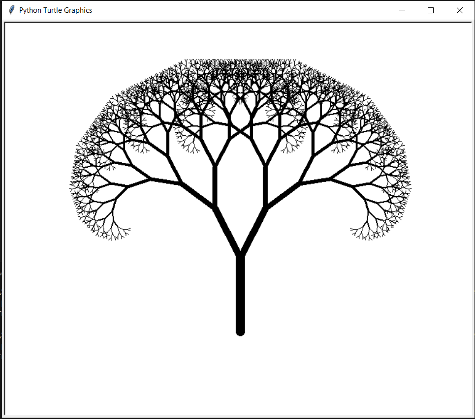
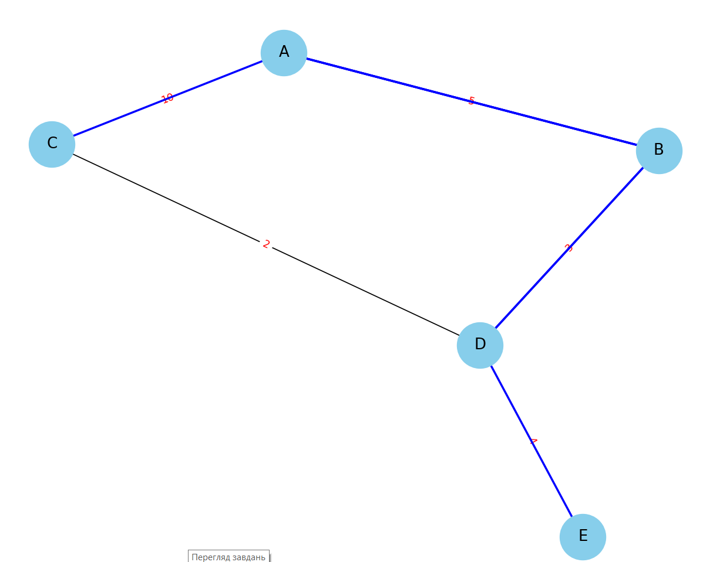
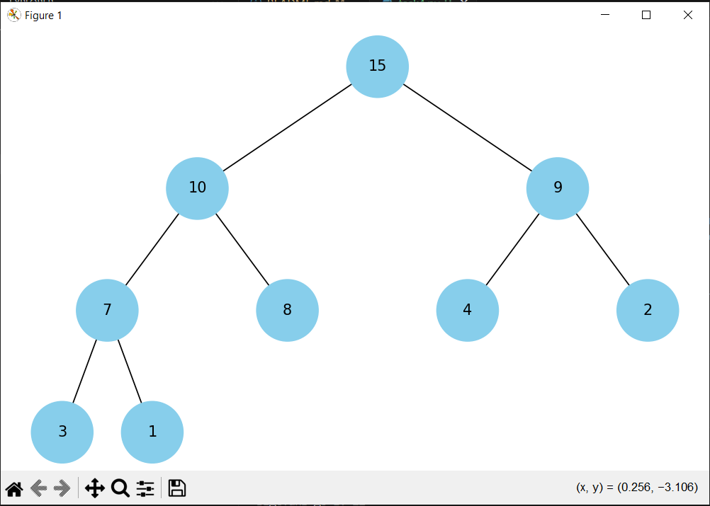
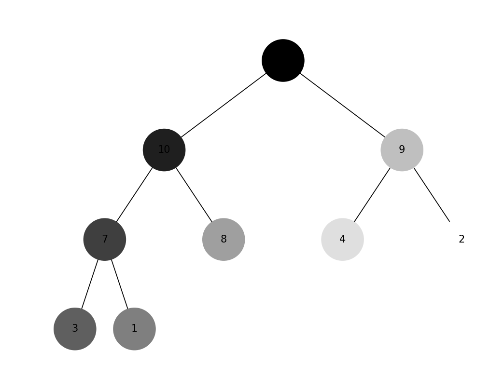
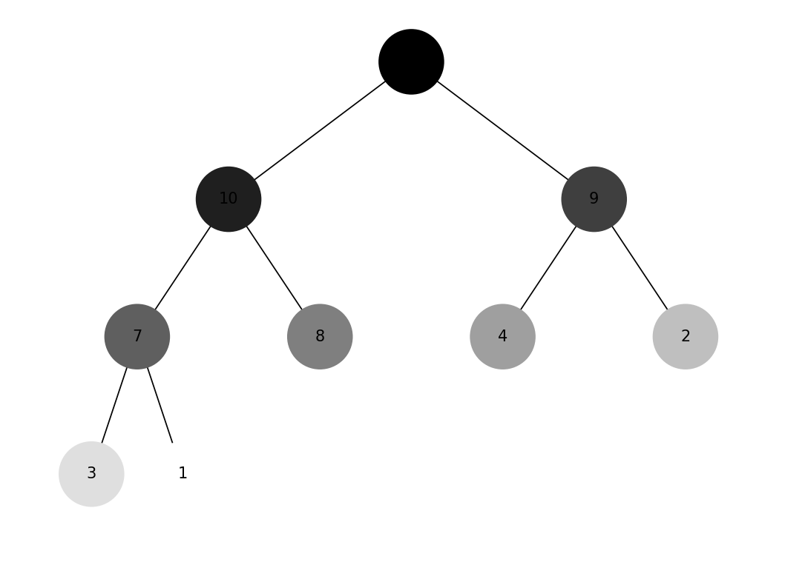

### task1

**Функції**

```reverse_linked_list(llist)```: Реверсує однозв'язний список.\
```merge_sort_linked_list(llist)```: Сортує однозв'язний список методом злиття.\
```merge_two_sorted_lists(list1, list2)```: Об'єднує два відсортовані однозв'язні списки в один відсортований список.

**Приклад використання**

```python
llist = LinkedList()
llist.insert_at_end(5)
llist.insert_at_end(3)
llist.insert_at_end(8)
llist.insert_at_end(2)
llist.insert_at_end(4)

print("Зв'язний список:")
llist.print_list()

reverse_linked_list(llist)
print("Реверсований зв'язний список:")
llist.print_list()

merge_sort_linked_list(llist)
print("Відсортований зв'язний список:")
llist.print_list()

list1 = LinkedList()
list1.insert_at_end(1)
list1.insert_at_end(3)
list1.insert_at_end(5)

list2 = LinkedList()
list2.insert_at_end(2)
list2.insert_at_end(4)
list2.insert_at_end(6)

merged_list = merge_two_sorted_lists(list1, list2)
print("Об'єднаний відсортований список:")
merged_list.print_list()
```

**Результат вконання коду:**

Зв'язний список:\
5 3 8 2 4 \
Реверсований зв'язний список:\
4 2 8 3 5\
Відсортований зв'язний список:\
2 3 4 5 8\
Об'єднаний відсортований список:\
1 2 3 4 5 6

### task2

**Використання**

1. Запустіть скрипт task2.py.
2. Введіть бажаний рівень рекурсії, коли буде запропоновано.


**Фрактальне дерево Піфагора**

Ось як виглядає фрактальне дерево Піфагора з рівнем рекурсії 10:



### task3

**Використання**

1. Переконайтеся, що у вас встановлені бібліотеки ```networkx``` та ```matplotlib```.
2. Запустіть скрипт.
3. Початкова вершина для алгоритму Дейкстри вказана у змінній ```start_node```.

**Результат**

Найкоротші шляхи  відображені синіми ребрами та вага ребер червоним текстом


Найкоротші шляхи від вузла A до всіх інших вузлів:\
Шлях до A: A\
Шлях до B: A -> B\
Шлях до C: A -> C\
Шлях до D: A -> B -> D\
Шлях до E: A -> B -> D -> E

### task4

**Візуалізація бінарної купи**



### task5

**Візуалізація обхід в ширину**


**Візуалізація обхід в глибину**


**Висновок**

Цей проект демонструє, як побудувати бінарну купу і візуалізувати її обходи за допомогою BFS і DFS. Вузли змінюють колір від чорного до білого, що вказує на порядок відвідування під час обходу.

### task6
**Результат**

Жадібний алгоритм:\
Вибрані страви: ['cola', 'potato', 'pepsi', 'hot-dog']\
Загальна кількість калорій: 870

Динамічне програмування:\
Вибрані страви: ['cola', 'cola', 'cola', 'cola', 'cola', 'potato']\
Загальна кількість калорій: 1450

**Висновок:**

Жадібний алгоритм:\
Вибирає страви, максимізуючи співвідношення калорій до вартості, не перевищуючи заданий бюджет.

Алгоритм динамічного програмування:\
Обчислює оптимальний набір страв для максимізації калорійності при заданому бюджеті.

### task7

**Ймовірності сум при киданні двох кубиків**

| Сума | Імовірність (симуляція) | Імовірність (аналітична) |
|------|-------------------------|--------------------------|
| 2    | 2.80%                   | 2.78%                    |
| 3    | 5.56%                   | 5.56%                    |
| 4    | 8.35%                   | 8.33%                    |
| 5    | 11.14%                  | 11.11%                   |
| 6    | 13.93%                  | 13.89%                   |
| 7    | 16.66%                  | 16.67%                   |
| 8    | 13.90%                  | 13.89%                   |
| 9    | 11.02%                  | 11.11%                   |
| 10   | 8.33%                   | 8.33%                    |
| 11   | 5.54%                   | 5.56%                    |
| 12   | 2.78%                   | 2.78%                    |

**Висновки**
- Результати симуляції методом Монте-Карло дуже близькі до аналітичних розрахунків, що підтверджує правильність і ефективність симуляційного підходу.
- Відхилення між симуляційними та аналітичними ймовірностями незначні і знаходяться в межах очікуваної похибки для великої кількості кидків.
- Метод Монте-Карло є потужним інструментом для оцінки ймовірностей та інших статистичних характеристик, особливо в ситуаціях, коли аналітичні розрахунки можуть бути складними або неможливими.
